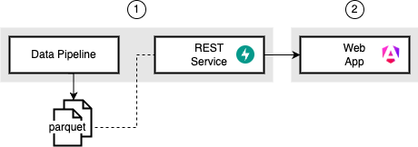

  

  <h1 align="center">Open Council Radar</h1>

  

    An app to crawl and investigate data of municipality information systems
  

# Architecture

Open Council Radar consists of the following components

* (1) [Backend](https://github.com/open-council-radar/open-council-radar-backend)
    * a data pipeline including
        * crawler
        * topic modeling
        * data aggregator
    * a FastAPI REST service providing
        * `GET` endpoints to retrieve data
* (2) [Frontend](https://github.com/open-council-radar/open-council-radar-frontend)
    * an Angular based web app